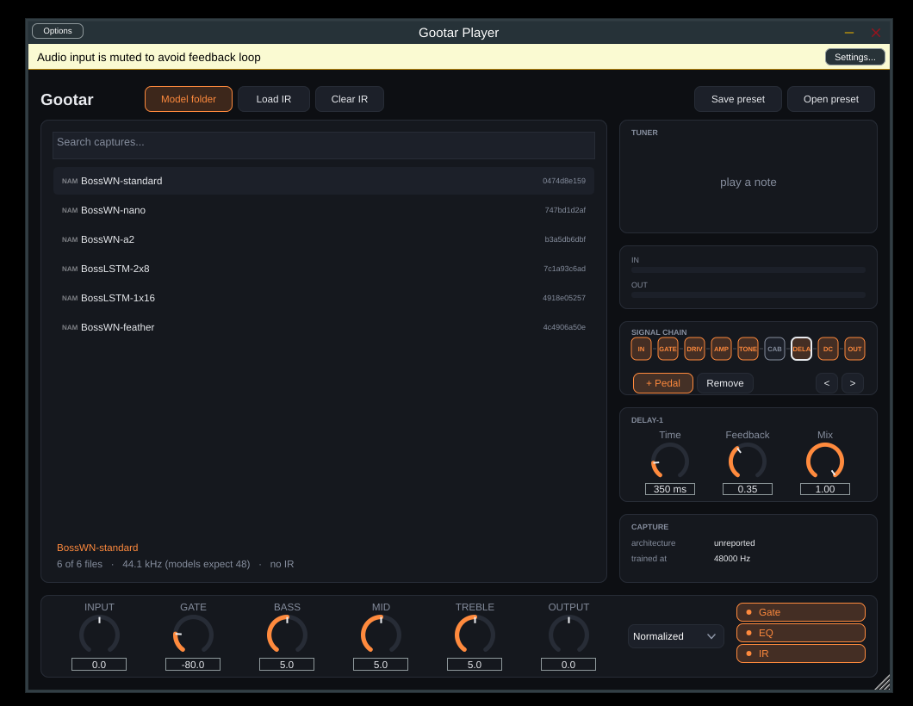
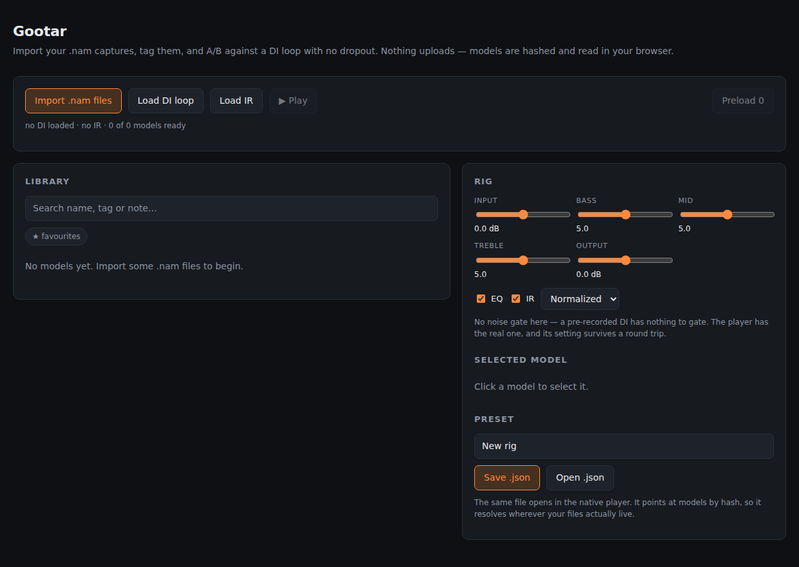

# Gootar

A preset-centric [Neural Amp Modeler](https://www.neuralampmodeler.com/) rig, in
two halves that share one preset format.

**Everything runs on your machine.** Nothing is uploaded, nothing is served to
the internet, and no audio ever leaves the computer.

**Player** — the real-time app you plug a guitar into. JUCE, ASIO,
NeuralAudio. Hot-swaps captures without interrupting playing.

**Librarian** — organise, tag, search and A/B your captures against a recorded
DI loop. It uses a browser as its window and runs at `127.0.0.1`, but it is a
local program: the NAM engine runs as WebAssembly inside the page, on your CPU,
and the only file it ever fetches is one it loaded from your own disk.

The gap it targets: TONE3000 has ~493 model packs and 450k+ downloads. People
accumulate hundreds of `.nam` files and have no way to organise, audition or
compare them — the stock plugin makes you file-browse one at a time.

## Status

Both halves work.

| | |
|---|---|
| Preset schema | zod source of truth, 9 tests, emits JSON Schema for the C++ side |
| Librarian (local UI) | imports + hashes + tags captures, gapless A/B against a DI loop, preset save/load. NAM-in-the-page **verified end to end** against a real capture |
| Player | full chain (gate / model / tone stack / IR / DC blocker / levels), model browser, hot-swap, preset I/O. Standalone **and** VST3 build |
| Pedalboard | drive, compressor, delay, reverb — add, remove and reorder them; a second amp capture is just another block. Saved with the preset |
| Tuner | MPM pitch detection off the clean input, ±cents readout |
| Hot-swap | 20k swaps against a live audio thread, clean under TSan and ASan/UBSan |

**[How to use it → `docs/USAGE.md`](docs/USAGE.md)**





## Quick start

**Windows**, all of it in one go:

```powershell
git clone --recurse-submodules https://github.com/Lechemilk33/gootar
cd gootar
.\setup.ps1          # or double-click setup.bat
```

Installs what is missing, lists your ASIO drivers, finds your captures, builds
the player and the VST3, runs the tests. See
[`docs/DEV-SETUP.md`](docs/DEV-SETUP.md).

Then:

- **`librarian.bat`** — starts the librarian UI and opens it
- `native\build\GootarPlayer_artefacts\Release\Standalone\Gootar Player.exe`

**By hand, any platform:**

```bash
npm install && npm run dev                    # librarian on 127.0.0.1:3000

cmake -S native -B native/build -DCMAKE_BUILD_TYPE=Release
cmake --build native/build --parallel
ctest --test-dir native/build --output-on-failure
```

`ctest` runs the concurrency stress test and the whole signal chain against the
real `.nam` files NeuralAudio ships — WaveNet Standard/Nano/Feather, A2, and
two LSTMs.

## Docs

- **[`docs/USAGE.md`](docs/USAGE.md)** — how to actually use it, start to finish
- **[`docs/DEV-SETUP.md`](docs/DEV-SETUP.md)** — building locally on Windows, and
  turning ASIO on (CI can't)
- [`docs/AUDIT.md`](docs/AUDIT.md) — what was verified against upstream source,
  and the places the original plan needed changing
- [`docs/ARCHITECTURE.md`](docs/ARCHITECTURE.md) — how the two halves fit
- [`docs/SIGNAL-CHAIN.md`](docs/SIGNAL-CHAIN.md) — the chain, transcribed from
  the stock plugin's `ProcessBlock`, with exact parameter ranges

## Layout

```
packages/preset-schema/   zod schemas -> types + JSON Schema; the shared format
apps/web/
  lib/audio/nam-rig.ts    gapless A/B over preloaded wasm NAM nodes (all local)
  lib/audio/chain.ts      the signal chain in Web Audio
  lib/library/            hashing, .nam parsing, IndexedDB
native/
  src/ModelSwapper.h      lock-free handover to the audio thread
  src/dsp/                the whole chain, with no JUCE in it
  src/app/                JUCE shell: browser UI, presets, library scan
  libs/                   JUCE, NeuralAudio, AudioDSPTools (submodules)
docs/                     usage, audit, architecture, signal chain
```

## Nothing phones home

- No remote URLs anywhere in the UI source; the only asset it loads is the NAM
  engine, served from your own disk.
- Next.js telemetry is off — the npm scripts set `NEXT_TELEMETRY_DISABLED`, so
  it applies on every machine rather than depending on someone remembering.
- Captures, IRs, tags and presets stay on disk and in your browser's local
  storage. There is no account, no backend and no database.

## Milestones

1. ~~Standalone app, audio in → out~~ done
2. ~~Load a `.nam` and hear it~~ done, on top of `ModelSwapper`
3. ~~IR convolution~~ done
4. ~~Gate + EQ + levels in the right order~~ done
5. ~~Preset save/load~~ done
6. ~~Model browser + hot-swap while playing~~ done — the product
7. ~~Chain multiple models (pedal → amp)~~ done — two captures in series is a
   chain edit, and the board is editable from the UI and saved in the preset

VST3 was never a milestone in the end: JUCE builds Standalone and VST3 as two
formats of one target, on from the start.

Not done: ASIO is off in CI because the SDK is a separate download
([USAGE](docs/USAGE.md) says how to turn it on), and there is no drag-and-drop
for reordering — the arrows do it.

## Built on

[NeuralAmpModelerCore](https://github.com/sdatkinson/NeuralAmpModelerCore) ·
[NeuralAmpModelerPlugin](https://github.com/sdatkinson/NeuralAmpModelerPlugin) ·
[NeuralAudio](https://github.com/mikeoliphant/NeuralAudio) ·
[neural-amp-modeler-wasm](https://github.com/tone-3000/neural-amp-modeler-wasm) ·
[JUCE](https://juce.com)
